# Python Web 服务器详细设计

<!-- TOC -->

- [Python Web 服务器详细设计](#python-web-服务器详细设计)
  - [项目概述](#项目概述)
    - [语言与环境](#语言与环境)
    - [项目需求简析](#项目需求简析)
  - [服务器基本逻辑设计](#服务器基本逻辑设计)
    - [WebServer 主程序模块设计](#webserver-主程序模块设计)
  - [响应线程设计](#响应线程设计)
    - [功能列表](#功能列表)
    - [程序流程](#程序流程)
    - [响应线程主要函数](#响应线程主要函数)
  - [GUI 设计](#gui-设计)
    - [功能组件](#功能组件)
    - [相关逻辑](#相关逻辑)
    - [相关函数设计](#相关函数设计)
  - [配置文件设计](#配置文件设计)
    - [配置内容](#配置内容)
    - [相关函数设计](#相关函数设计-1)
  - [运行方式与效果演示](#运行方式与效果演示)
    - [运行方式](#运行方式)
    - [效果演示](#效果演示)
      - [服务器运行状态](#服务器运行状态)
      - [GET 单项资源演示](#get-单项资源演示)
      - [GET 复数资源演示](#get-复数资源演示)
      - [POST 请求体文件生成和 DELETE 请求目标文件删除演示](#post-请求体文件生成和-delete-请求目标文件删除演示)

<!-- /TOC -->

## 项目概述

### 语言与环境

- 项目开发语言：
  - Python 2.7.10
- 项目开发环境：
  - 操作系统：MacOS
<!-- - 项目运行环境：
  - FreeBSD 标准下的类 Unix 系统
    - 需要该标准以支持系统的 Tail 命令
  - 基于 Kneral 构建的 GUI 界面
    - 需要该标准以支持系统 GUI 和文件夹展示操作 -->


### 项目需求简析

根据作业要求，该简单 Web 服务器能够实现如下功能：

1. 响应 GET 请求，解析资源并返回
2. 响应 POST 请求，解析请求体，并保存至目标文件
3. 响应 Delete 请求，解析资源，尝试删除该文件
4. 拒绝响应其他方式的请求，返回请求错误（400 BAD Request）
5. 监测错误，返回服务器内部错误或网关错误（500 Internal Server Error | 502 BAD Gateway）
6. 实现日志系统，能够记录系统的 HTTP 请求、运行状态等信息
7. 实现 GUI，能够实现如下功能：
    1. 在 GUI 上启动和关闭服务器系统
    2. 在 GUI 上展示系统运行状态
    3. 在 GUI 上展示系统实时日志
    4. 打开配置文件夹
    5. 关闭并清理当次系统运行进程

   
## 服务器基本逻辑设计
###  WebServer 主程序模块设计
<div align="center">

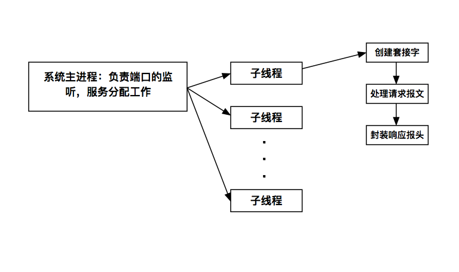

系统整体逻辑

</div>
本次作业使用多线程编程的方式实现多资源解析，该方式能够有效提高系统的响应能力，降低等待时间，从而更好地支持由 HTML 编写的测试界面

系统的主体如上图所示，主进程负责接受来自客户端（可能是浏览器或 wget 等 HTTP 请求命令工具）的请求，在简单包装和获取目标报文后，分入单个子线程中，对目标报文进行解析和响应。

在每个子线程中的主要逻辑请参考[后文的设计内容](#响应线程设计)

系统主进程的主要工作包括：
- 解析传入参数
- 初始化系统配置
- 根据传入参数决定启动或关闭系统
- 根据传入参数决定是否以守护进程形式启动
- 根据系统配置创建监听接口
- 接受（accept）请求，将请求体保存并发送往子线程

因此，在系统主进程中设计如下函数：

```Python 
def init_socket(HOST, PORT):
    # create , set up , bind and listen the socket
    while True:
        # get the connection and client_address
        # recv the request message
        # create new thread to handle this message
        
def start_web_server(path=None):
    # read the config files
    # initialize the log system
    # initialize the listening socket
    
def daemonize (switch="False"):
  if switch == "True":
    # start the Web Server as a daemon process

def shut_down(switch="False"):
    if switch == "True":
        # kill the process
```

## 响应线程设计

### 功能列表

- 接受 HTTP 请求报文
- 解析 HTTP 请求报文
  - 按行分割（该部分内容来自定义）
  - 按分隔符切分各行
    - 首部行，或称资源行
    - 请求头部行
    - 空行
    - 请求体，不分割
- 解析请求资源，来源是首部行
  - 请求方法
  - 请求资源
  - HTTP 协议版本号
- 按照各个资源的请求方式，switch(request_method)，分配各个响应逻辑
  - get_handler
  - post_handler
  - delete_handler
  - default_handler
- 根据响应情况，封装响应报文
  - 响应头
    - 一部分根据响应情况填充
      - content_type
      - content_length
    - 一部分与响应情况无关
      - Server
      - date
  - 响应体
    - 默认返回情况
    - 错误返回情况
    - 实体返回情况
- socket 传送

### 程序流程
<div align="center">

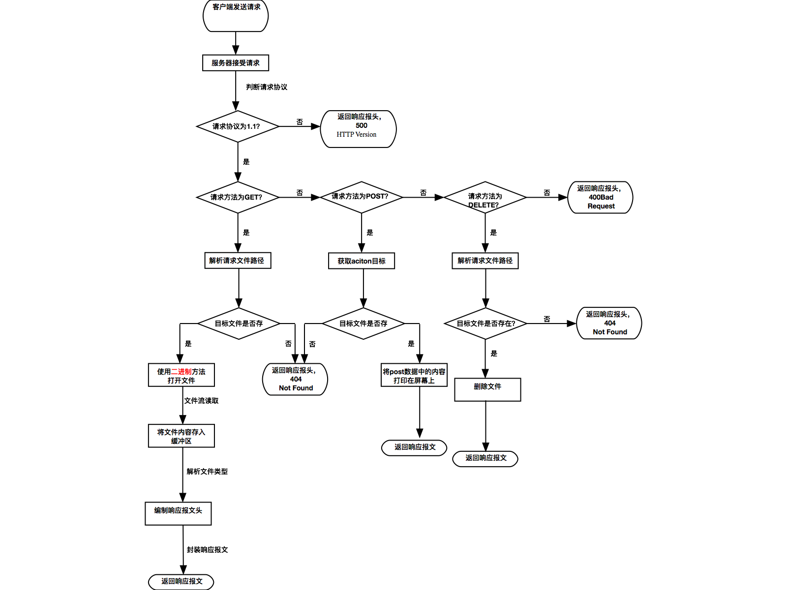

响应流程
</div>
针对上述的功能列表，我们设计了如图所示的响应线程逻辑

### 响应线程主要函数

```Python

# thread entry point
def httpRequestHandler(connection, HTTPRequest):
  # split the HttpRequest message
  # read the message splits
  # handle the resource request
  # build the response body
  # send the response message

# response header building function
def process_response_header(request_headers):
  # process the static information in response header
  # such as : Server, Date or Connection
    
# resource request handling function
def process_resource(request_method, request_resource, HTTPVersion, request_body,response_header):
  # call the different handler according to the request_method
  try:
    if request_method == "GET": # GET handler
      return processGET(request_resource, response_header)
    elif request_method == "POST": # POST handler
      return processPOST(request_resource, request_body, response_header)
    elif request_method == "DELETE": # DELETE handler
      return processDELETE(request_resource, response_header)
    else: # refuse to handle the request
      response_header[LINE_LENGTH] = len(MSG_BAD_REQUEST)
      return MSG_BAD_REQUEST, RESPONSE_HEADER_BAD_REQUEST
  except Exception, e: # error handling
    return MSG_BAD_GATEWAY, RESPONSE_HEADER_BAD_GATEWAY
    
def processGET(request_resource, response_header):
  # try to get the file
  # read the file as binary content
  # response according to the running status

def processPOST(request_resource, request_body, response_header):
  # try to create the file
  # write the request body into file
  # response according to the running status
  
def processDELETE(requestResource, response_header):
  # get the file and try to remove
  # response according to the running status
  
# response body sending function
def send_response(client_connection, http_response):
  # send the http_response argument into the client_connection
```

## GUI 设计

### 功能组件

- 用文本框显示日志
- 用一个按钮来启动配置修改功能
- 用一个标签来监视 WebServer 的运行状态
- 用一个按钮来启动/关闭 WebServer 接口
- 用一个按钮来关闭程序

### 相关逻辑

- 组件绑定逻辑，即初始化过程
- start_daemon_server，启动 WebServer
- open_conf_directory，启动配置修改接口
- shut_down，关闭系统
- read_log，用于读取日志文件并追加在日志监听文本框内

### 相关函数设计

```Python
# GUI initial function
def __init__(self, master):  
    Configuration.init() # init the config
    # set btn_frame to contain the operation buttons
    self.btn_frame = Frame(master) 
    # set log_frame as for showing log
    self.log_frame = Frame(master)
    self.log_box = Text(self.log_frame...)

    # set status_frame as for showing system status
    self.status_frame = Frame(master)

# System control function
def start_daemon_server(self):  
  # start the web server
  # use a switch to count the button press action, decide whether turn on or turn off the system

# Configuration control function
def open_conf_directory(self):
  # call the system directory service

# GUI closing function
def shut_down(self):
  # close the web server process
  # close the gui process

# Log file listening function
def read_log(log_box,logfile):
  pass
```


## 配置文件设计

### 配置内容

纵观程序逻辑，其中需要配置的内容主要为：
- 启动端口号
- 监听主机名
- 服务器资源解析基础路径
- 日志配置

Python 提供了 ConfigParser，可以根据文件路径，自动解析配置文件，因此配置加载模块所需要做的主要内容为：
- 解析命令行传入参数
- 从传入参数中读取配置文件夹路径
- 根据命名规则读取配置文件，并为设置各个值

### 相关函数设计

```Python
# initialize function
def init(config_path = None):
    # set all global variable according to the input variable config_path
    # save the content-type check list
# config path prefix process function 
def setConfigPath(path = None):
    # set the global variable CONFIG_PATH 
    
# input argument parse function
def parse_system_arg(argv):
    # parse the argument vector, save it into a map
```

## 运行方式与效果演示

本节将简要描述本次作业的成果是如何运行的

### 运行方式
1. 环境安装

> Python 环境安装

在 Mac 环境下使用 HomeBrew
```bash
brew install python2.7
```
或在 Linux 环境下使用其内置的包管理工具，这里以 Ubuntu 的 apt 为例
```bash
sudo apt-get install python
```
2. 文件列表
    <div align="center">

    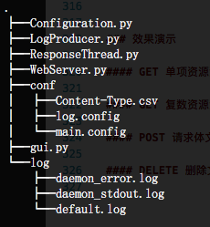
    
    文件列表
    </div>

    - 程序源码，含可执行代码
      - [WebServer.py](WebServer.py) 该文件是主体程序文件，可以直接运行，也可以使用 Python 命令运行
      - [Configuration.py](Configuration.py) 配置解读模块源码
      - [ResponseThread.py](ResponseThread.py) 响应线程模块源码
      - [gui.py](gui.py) 增强界面模块源码，可以直接运行
    - 配置文件列表
      - [Content-Type.csv](conf/Content-Type.csv) 该文件存储有不同类型对应的 Content-Type 响应报文头的返回内容
      - [log.config](conf/log.config) 该文件存储有日志系统的配置内容
      - [main.config](conf/main.config) 该文件存储有本项目的主要配置内容
    - 日志文件列表
      - [default.log](log/default.log) 该文件为默认日志输出环境，可以在日志系统配置中重载
      - [daemon_error.log](log/daemon_error.log) 该文件为守护进程使用的错误输出文件
      - [daemon_stdout.log](log/daemon_stdout.log) 该文件为守护进程使用的标准输出文件

3. 运行方式

> 命令行启动

命令行启动方式要求 `WebServer.py` 文件具有运行权限，可以利用`ls -l`命令确认，启动命令为

```bash
./WebServer.py -[d|c|p]
```

目前可以配置的参数有：
- -d=[True|False]，默认为 False，该参数代表是否以守护进程运行
- -c=[True|False]，默认为 False，该参数代表是否强制结束所有运行实例
- -p=[path_to_conf]，默认为空，但在系统中取值`conf/`，该参数代表系统的配置路径，可以使用绝对路径和相对路径，但是请在类 Unix 系统下使用

命令行启动有两种方式，一是普通模式运行，二是守护进程模式运行

1. 普通模式运行

普通模式运行命令实例
```bash
./WebServer.py -d=False -p=conf/ -c=False
```
停止该模式可以直接使用 ctrl+c 组合键

2. 守护进程模式运行

守护进程启动命令实例
```bash
./WebServer.py -d=True -p=conf/ -c=False
```
守护进程关闭命令实例
```bash
./WebServer.py -c=True
```

该模式实际上是以一种类似僵尸模式运行的有序程序，需要利用 daemonize 函数关闭其两代父进程，并且在其中会调用 `chdir('/')` 方法改变当前进程运行目录，所以请务必注意Based_dir 的配置

> 图形界面的运行

本次实验参考了 XAMPP 的形式，服务器主体程序与图形界面系统分别编写和部署，启动图形界面的方法是在确认 gui.py 具有执行权限后直接运行该文件即可，配置文件的修改请手动修改目标文件

```bash
./gui.py
```

### 效果演示

#### 服务器运行状态

服务器的命令行运行状态，该模式运行后，会在 Shell 窗口处留下一个阻塞的进程，在使用 ctrl+c 强制结束进程后，可以看到 Shell 中显示了 KeyboardInterrupt 的提示，说明这个进程在运行过程中受到 Shell 本身的制约

```Bash
Serving HTTP on port 10086 ...
^CTraceback (most recent call last):
  File "./WebServer.py", line 80, in <module>
    start_web_server(start_args.get("-p",None))
  File "./WebServer.py", line 33, in start_web_server
    init_socket(Configuration.HOST,Configuration.PORT) 
  File "./WebServer.py", line 24, in init_socket
    client_connection, client_address = listen_socket.accept()"/System/Library/Frameworks/Python.framework/Versions/2.7/lib/python2.7/socket.py", line 206, in accept
    sock, addr = self._sock.accept()
KeyboardInterrupt
```

服务器的守护进程运行状态，该模式运行后，不会在 Shell 窗口中留下任何痕迹，但是使用 `ps -ef | grep WebServer.py` 方式运行后可以看到该程序的 pid，说明改程序处在运行状态，但是并不会在 Shell 中阻塞运行

```bash
⋊> ~/g/t/W/PyWebServer ./WebServer.py -d=True -p=conf/         
⋊> ~/g/t/W/PyWebServer ps -ef |grep WebServer.py         
  501 61324     1   0  5:22下午 ??         0:00.01 python ./WebServer.py -d=True -p=conf/
  501 61412 97805   0  5:23下午 ttys007    0:00.00 grep --color=auto WebServer.py
⋊> ~/g/t/W/PyWebServer         
```

GUI 展示

系统的 GUI 如下图所示
- 界面的左侧是日志系统，其会取回系统自启动后日志文件中最后10条记录，并在运行后自动更新
- 系统的右侧是系统运行状态，其会根据系统的配置显示系统的运行配置
- 系统的下方是控制按钮栏
  - 左侧的按钮会根据系统是否处在运行状态切换字符串和功能
  - 中间的按钮会根据系统的默认配置打开运行配置文件夹
  - 右边的按钮会关闭服务器进程和图形界面
<div align="center">

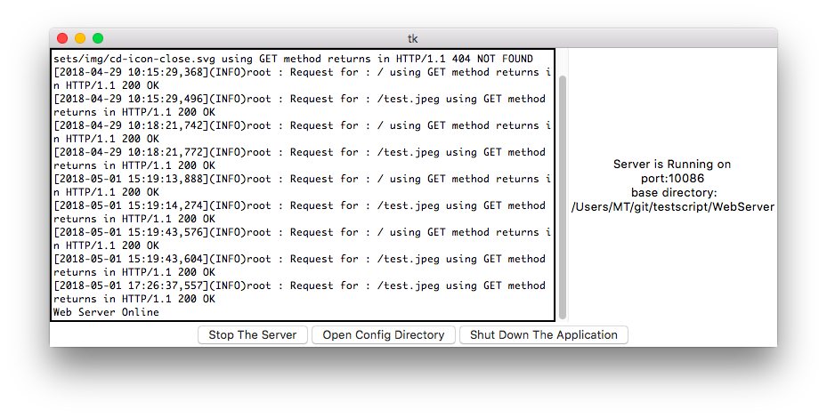

系统图形界面展示

</div>

#### GET 单项资源演示

现在演示的是直接从服务器中获取一个文件，文字内容太过简单，直接展示图片文件的读取效果

<div align = "center">

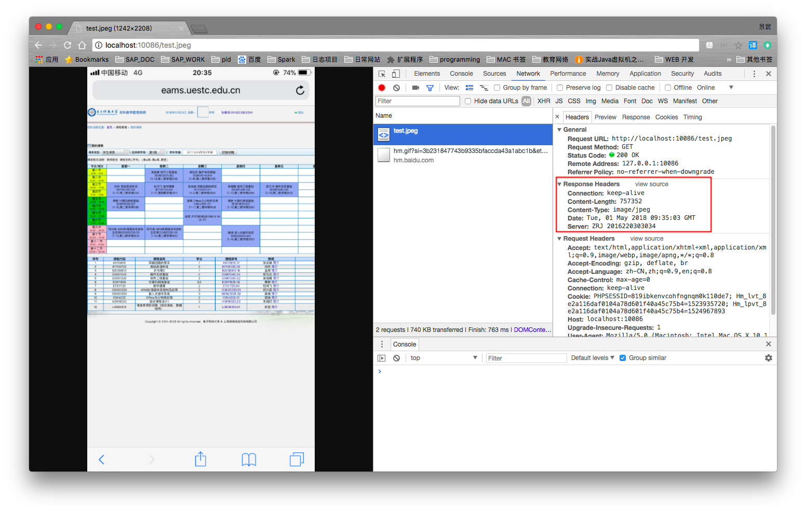

单张图片资源获取

</div>

个人信息和本次实验过程加工的 Response Header 请见红框

#### GET 复数资源演示

get 方法获取复数资源的演示以从网络上下下来的一整套 HTML 为基础，如下图所示，能够看到请求了附属个文件和请求的时间轴关系

<div align="center">

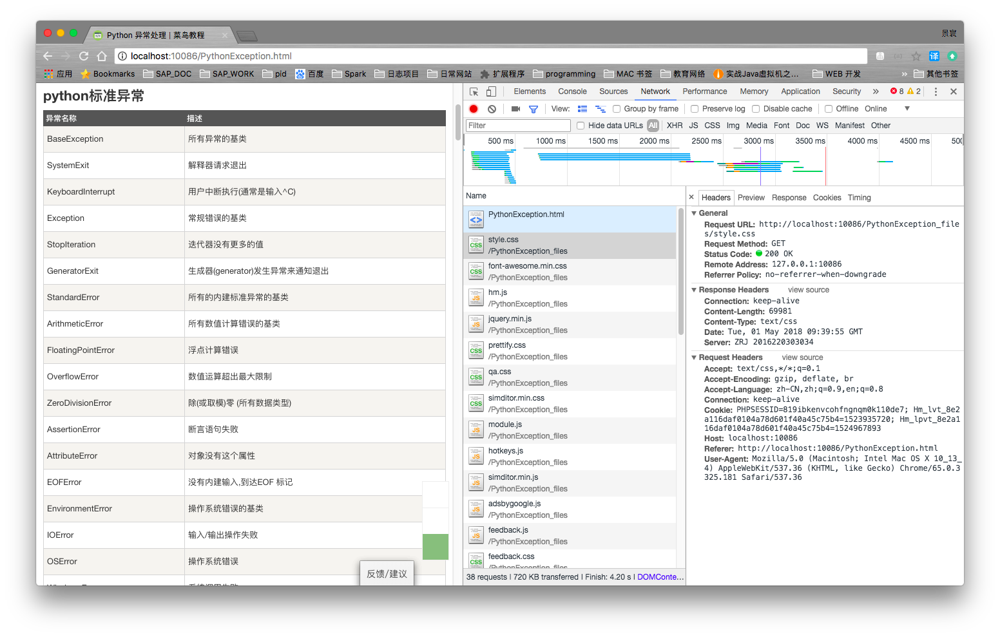

GET 复数资源演示
</div>


#### POST 请求体文件生成和 DELETE 请求目标文件删除演示

该部分两部分展示，一是已经尚未具有目标文件，二是已经具有目标文件时的表现，这里使用  postman 作为请求生成工具
<div align="center">

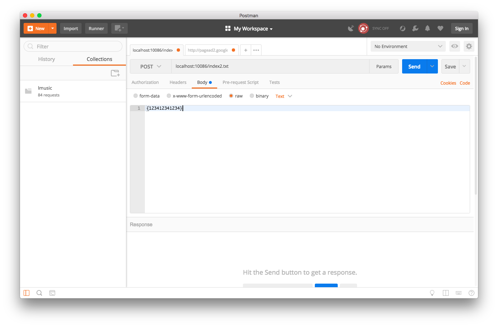
利用 postman 创建一个请求

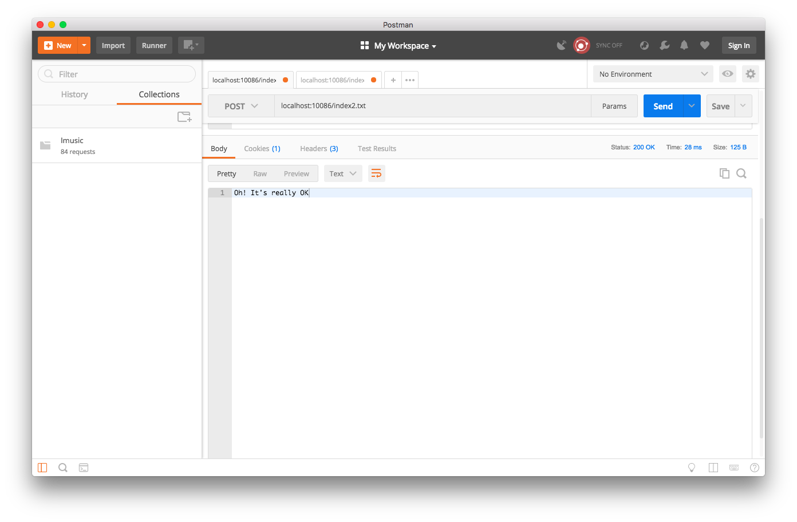
请求成功后的返回结果


使用 Get 方法请求目标文件

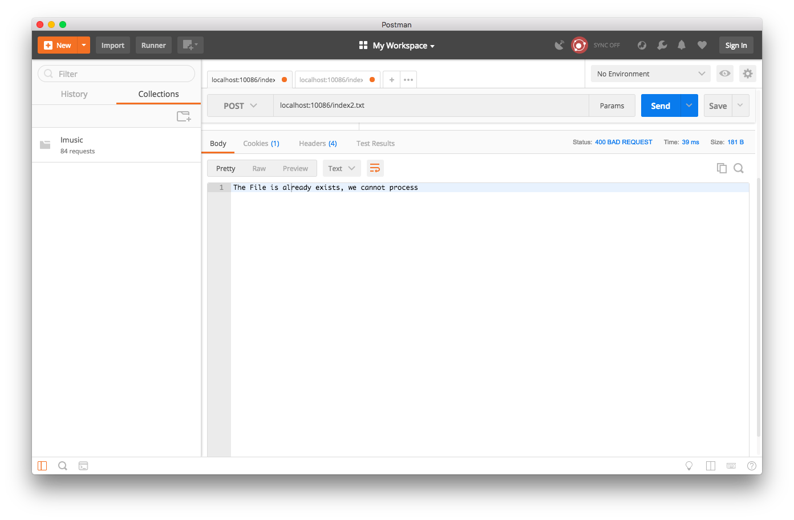
重复请求目标文件后报错

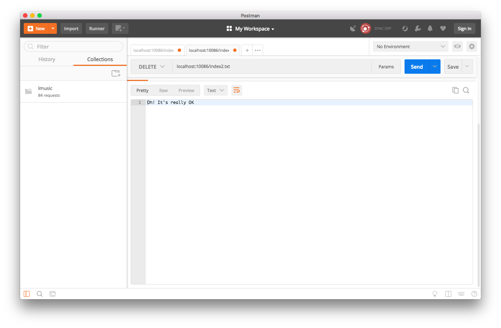
请求删除目标文件

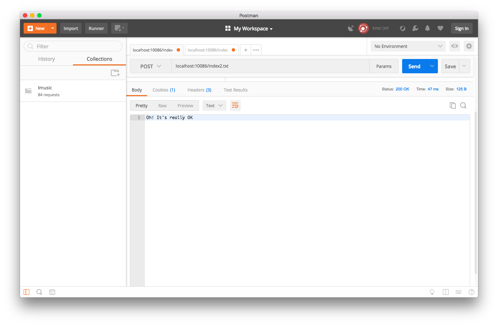
可以再次创建目标文件了

</div>
